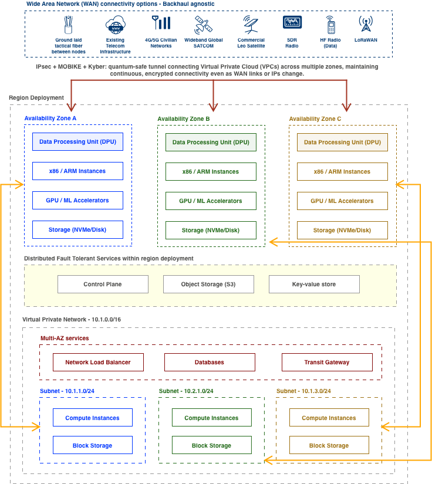

# Mulga Edge Mesh Simulator

Mulga Edge Mesh Simulator is a Containerlab-based environment for emulating Mulga OS multi-zone edge networks. It models distributed VPCs, DPUs, and FRR-based iBGP routing across simulated backhauls including 4G/5G, SDR, Starlink, and LoRaWAN control links. The simulator enables testing of latency, bandwidth constraints, loss conditions, and self-healing mesh behavior in sovereign, post-quantum-secure edge deployments.



### How it works

- Each zone node simulates a Mulga OS deployment site with unique /24 inside 10.1.0.0/16.
- Route reflector (rr) simplifies iBGP peering for all zones.
- The WAN links (4G/5G, SDR, Starlink) are modeled with realistic delay, bandwidth, and loss.
- The LoRaWAN links create a low-bandwidth fallback control mesh that stays alive even under degraded conditions.

### Usage

```
# Deploy
sudo containerlab deploy -t mulga-topology.clab.yml

# Access a node
docker exec -it clab-mulga-sim-zone1 bash

# Show FRR routes
vtysh -c "show ip bgp summary"
```

### Configuring iBGP and FRR

To simulate iBGP / FRR, create a basic `frr.conf` into each node’s /etc/frr/ mount.

For example:

Zone 1 `frr.conf`

```
router bgp 65000
 bgp router-id 10.1.1.1
 neighbor 10.1.2.1 remote-as 65000
 neighbor 10.1.3.1 remote-as 65000
 network 10.1.1.0/24
```

Zone 2 `frr.conf`

```
router bgp 65000
 bgp router-id 10.1.2.1
 neighbor 10.1.1.1 remote-as 65000
 neighbor 10.1.3.1 remote-as 65000
 network 10.1.2.0/24
```

Zone 3 `frr.conf`

```
router bgp 65000
 bgp router-id 10.1.3.1
 neighbor 10.1.1.1 remote-as 65000
 neighbor 10.1.2.1 remote-as 65000
 network 10.1.3.0/24
```

### Development

- Under development for simulating with WireGuard or IPsec containers (e.g., strongSwan or wg-quick) for encrypted overlay testing.
